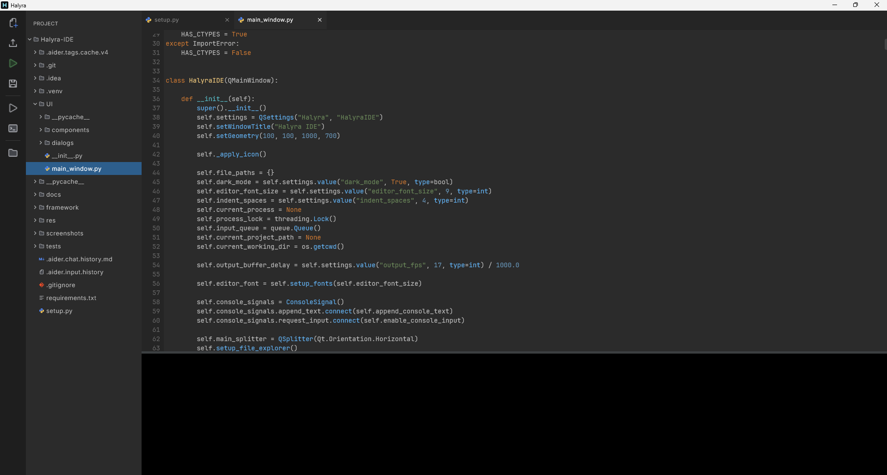

# Halyra
A lightweight Python IDE for fast prototyping of your choice

**Write, Run, and iterate on Python without the overhead of a full sized IDE**



---
## Build It Youself!
```bash
git clone https://github.com/aavarvdXD/Halyra.git
cd Halyra
./gradlew run
```
**Requires Java 17 or higher and Python installed and available on** `PATH`  
If you're on Windows, execute `gradlew.bat run` instead of `./gradlew run`


---
## Project Features
- **Prototyping Mode**: Execute Python code directly from the editor without needing to save a file first. If no file is saved, a temporary `halyra_proto_*.py` file is created and deleted after execution.
- **Multi-Tab Support**: Open multiple files, switch between them, and scroll through tabs when they exceed the screen width
- **Smart Editor**: 
    - Auto-closing of `()`, `[]`, `{}`, `"`, and `'`.
    - Type-over support: If the user types a closing character that matches the auto-inserted one at the caret, the caret just moves forward
    - Python-style auto-indentation: Automatically adds current indentation + 4 spaces after a newline following `:`
    - Custom backspace: Deletes 4 spaces at once if they form an indentation block
- **Integrated Terminal**: Resizable vertical terminal for output and input
- **Safety**: Unsaved changes detection across all tabs with an exit confirmation dialog
- **Project Explorer**: A file tree with icons for quick navigation and file management

---

## How it Works
Halyra is built with Kotlin and Compose Multiplatform, structured around a small set of focused components rather than one UI file: `AppState` holds centralized app state, `FileManager` owns the file/tab lifecycle, and `PythonProcess`/`ShellProcess` each wrap a persistent subprocess for running code and driving an interactive shell

---

## Acknowledgements
Built with Compose Multiplatform and the JetBrains Mono typeface